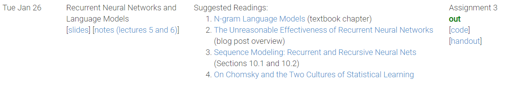

## ⭐ *安装指南*
依赖包安装，建议找镜像源，尤其是 pytorch
```bash
pip install -r requirements.txt
```
除此之外还要安装 en_core_web_sm 语料库
```bash
python -m spacy download en_core_web_sm
```
安装指南见 https://spacy.io/usage   
## 📚 *学习建议*
pytorch快速学习指南
https://pytorch.org/tutorials/beginner/basics/intro.html   
pytorch文档   
https://pytorch.org/docs/master/   
spaCy   
https://spacy.io/   
Stanford公开课 CS224N   
http://web.stanford.edu/class/cs224n/   
spaCy作者早期博客   
https://explosion.ai/blog/parsing-english-in-python
## 🌌 *这个项目不咋样？*
* CS224N Assignment 3
  
* Redshift   
https://github.com/syllog1sm/redshift
* spaCy作者早期博客中提及的 demo   
  https://gist.github.com/syllog1sm/10343947
## 🛠 *想实现中文句法分析器？*
spacy提供了中文自然语言处理相关组件   
https://spacy.io/models/zh
## 📖 *数据集信息*
|文件名|行数|句子数|单词数
| --- | --- | ---| ---
| **dev.conllu** | 41817 | 1700 |40117
| **train.conllu** | 989860 | 39832 | 950028
| **test.conllu** | 59100 | 2416 | 56684

